# 🏛️ PrivacyPulse AI 

**“Understand Before You Accept.”**  
*Built by Nikita Mulam for the Google Chrome Built-In AI Challenge 2025*


---

**PrivacyPulse AI** is an intelligent web platform that **analyzes and summarizes privacy policies in real time**.  
It combines a **Chrome Extension** and **Web Portal**, powered by **FastAPI**, **Gemini API**, and a **Random Forest model** to classify websites as **Safe / Neutral / Risky**.  
Using **Playwright** automation, it extracts complex policy data and delivers **clear, concise insights** — empowering users to make informed decisions *before* accepting.

---

## 🧩 System Architecture

---



```mermaid
sequenceDiagram
    participant U as 👤 User
    participant CE as 🧩 Chrome Extension
    participant WUI as 🌐 Web Interface
    participant BE as ⚙️ FastAPI Backend
    participant AI as 🧠 Gemini API
    participant DB as 🗄️ MongoDB
    participant UI as 💻 Dashboard

    %% Chrome Extension Flow
    U->>CE: Visit website
    CE->>BE: Send extracted Privacy Policy text
    BE->>AI: Request summary & risk analysis
    AI-->>BE: Return analyzed summary
    BE->>DB: Store results
    BE-->>CE: Send summarized insights
    CE-->>U: Display real-time popup summary

    %% Web Portal Flow
    U->>WUI: Enter/paste website URL
    WUI->>BE: Send URL for scanning (via Playwright)
    BE->>AI: Analyze privacy policy
    AI-->>BE: Return summary & classification
    BE->>DB: Save results
    BE-->>WUI: Return structured summary
    WUI-->>U: Display insights

    %% Dashboard Access
    U->>UI: Open dashboard
    UI->>DB: Fetch stored analyses
    DB-->>UI: Display risk reports and insights

```

## ⚙️ Tech Stack

| Layer           | Technology                          |
| --------------- | ----------------------------------- |
| Frontend        | HTML, CSS, JS, Chrome Extension API |
| Backend         | FastAPI (Python)                    |
| AI Layer        | Gemini API + Random Forest Model    |
| Web Scraping    | Playwright                          |
| Database        | MongoDB                             |
| Hosting         | Render /  Local Testing     |
| Version Control | Git + GitHub                        |


## 🧪 Installation & Setup

### 1. Clone the Repository
```bash
git clone https://github.com/NikitaMulam2005/PrivacyPulseAI.git
```

### 2. Backend Setup
```bash
cd backend
pip install -r requirements.txt
cd ..
uvicorn main:app --reload --host 0.0.0.0 --port 8000
```

### 3️. Extension Setup

1. Open **Chrome** → **Extensions** → **Manage Extensions**  
2. Enable **Developer mode** (toggle in the top-right)  
3. Click **"Load unpacked"**  
4. Select the `extension/` folder inside the project  

> **Test it:** Visit any website — the **privacy summary popup** will appear automatically!

### 4. Web Portal
Run the frontend (if separate React/Vite app):

```bash
npm install
npm start
```

## 🧪 Testing the Application
1. Launch the FastAPI backend.  
2. Load the Chrome Extension in your browser.  
3. Visit any website with a visible privacy policy.  
4. You’ll see a real-time summary popup.  
5. Optionally, open the web portal and paste any URL to view full analysis and reports.

## 🪪 License

This project is licensed under the **MIT License**.  
See the [LICENSE](LICENSE) file for details.

## 🚀 Live Demo

🧩 **Chrome Extension (Demo Video):** [Watch Demo](https://www.youtube.com/watch?v=abc123)  
🌐 **Web Portal:** [Try It Live](https://privacypulse-frontend.onrender.com/)
